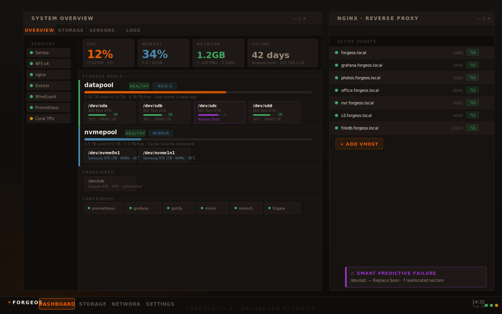
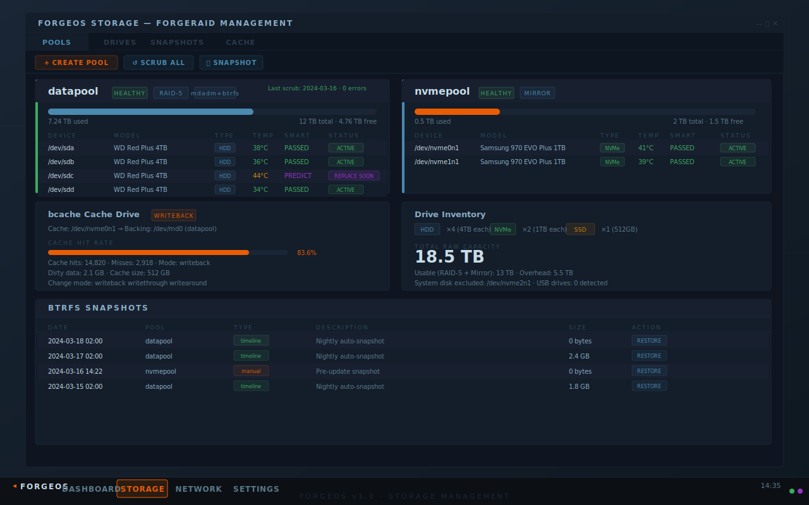
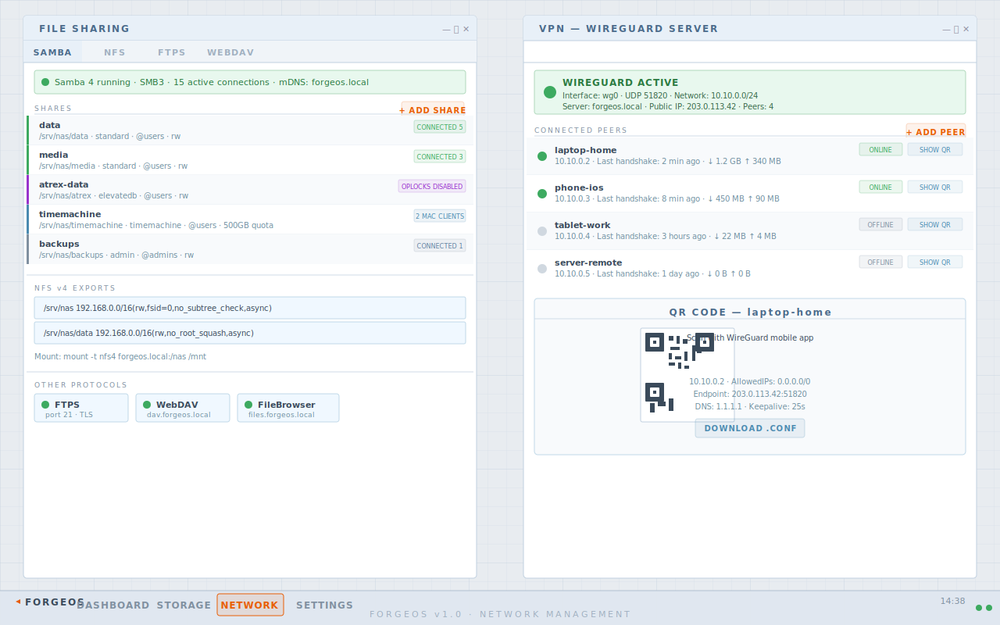
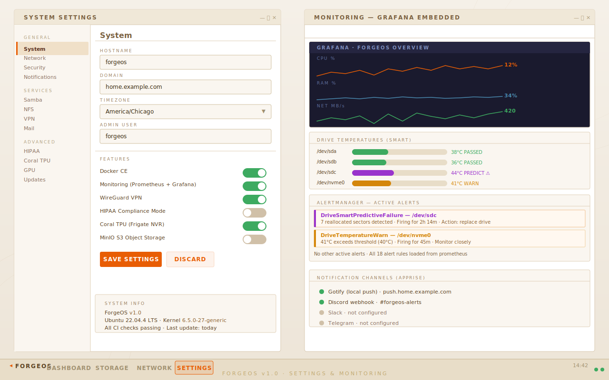
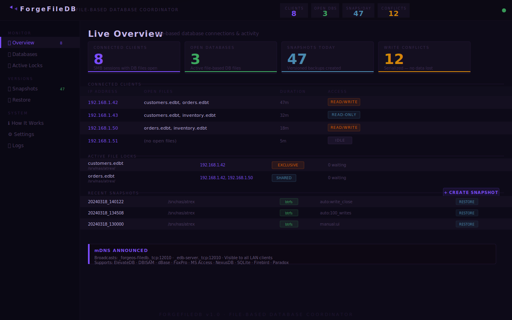
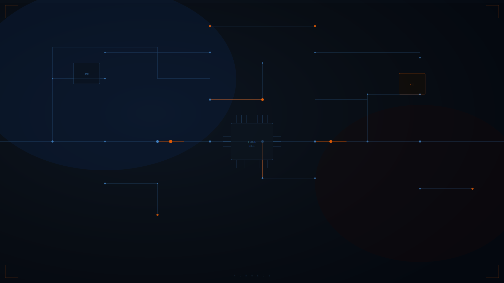
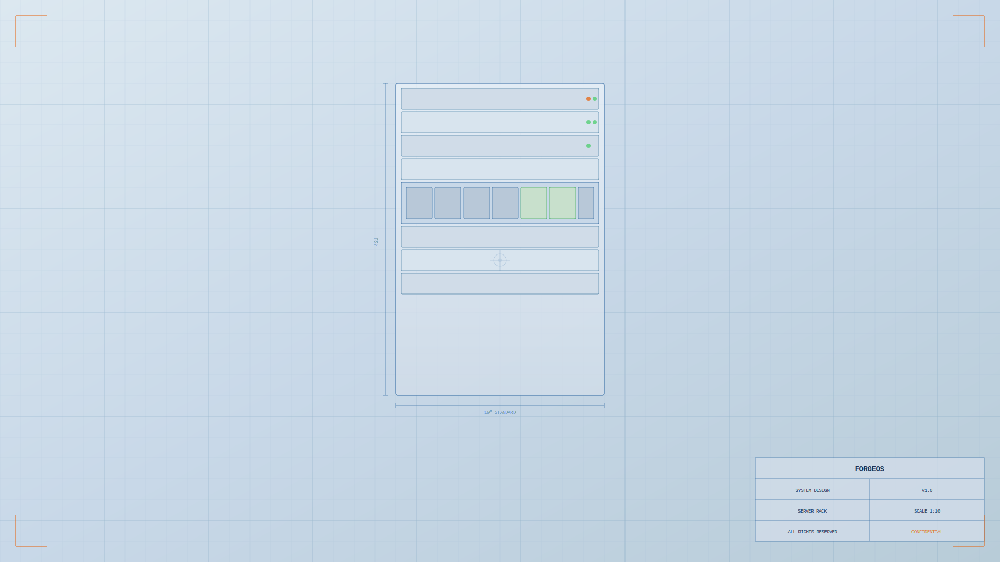

<div align="center">

```
     ___                 ___  ____
    / __\___  _ __ __ _ / _ \/ ___|
   / _\ / _ \| '__/ _` | | | \___ \
  / /  | (_) | | | (_| | |_| |___) |
  \/    \___/|_|  \__, |\___/|____/
                  |___/
```

**Open-source NAS and home server platform built natively on Ubuntu/Debian.**

[](https://github.com/YOUR_USERNAME/forgeos/actions/workflows/ci.yml)
[](https://github.com/YOUR_USERNAME/forgeos/actions)
[](LICENSE)
[](README.md)

</div>

---

ForgeOS is a complete, production-ready NAS and home server platform that installs directly on top of Ubuntu or Debian. A single installer script and an interactive wizard configure everything from storage pools to VPN, mail, monitoring, and a full Web GUI.

Designed for **homelabs and small businesses**. Enterprise features (HIPAA compliance, LDAP/SSO, file-database coordination) are optional modules that stay completely out of the way for users who don\'t need them.

---

## Screenshots

### Dashboard — Live System Overview

The Industrial Steel / Forge Orange desktop shows live drive health grouped by pool, service status, container states, and real-time metrics. A predictive SMART failure on `/dev/sdc` triggers a purple tray alert and toast notification.



---

### Storage — ForgeRAID Management

Drive classification (HDD / SSD / NVMe / USB) is automatic. Pool creation, scrubbing, snapshots, and bcache cache-drive setup are all available from the same panel. The SMART table shows per-drive temperature, reallocated sectors, and health state with colour-coded severity.



---

### Network — File Sharing, VPN & nginx

Samba share management with five built-in templates (including `elevatedb` for file-based database corruption prevention), NFS v4 exports, WireGuard VPN peer management with live QR code generation, and the nginx reverse proxy vhost manager.



---

### Settings & Monitoring

Feature toggles, system configuration, and an embedded Grafana panel with real-time CPU/memory/network sparklines, per-drive SMART temperature bars, active Alertmanager alerts, and Apprise notification channel status.



---

### ForgeFileDB — File-Based Database Coordinator

Prevents SMB oplock corruption for ElevateDB, DBISAM, dBase, MS Access, FoxPro, NexusDB, SQLite, Firebird, and Paradox without any changes to client software. Live connection monitoring, write-conflict tracking, btrfs versioned snapshots, and mDNS network discovery.



---

### Wallpapers

Four built-in SVG wallpapers:

| Dark — Forge | Dark — Circuit | Light — Blueprint | Light — Dawn |
|:---:|:---:|:---:|:---:|
|  |  |  |  |

---

## Features

### Storage

| Feature | Details |
|---|---|
| **ForgeRAID** | mdadm + LVM + btrfs. Mixed-size drives. RAID 1/5/6/10 and JBOD |
| **Drive classification** | Automatic HDD / SSD / NVMe / USB detection, displayed in Web UI |
| **Cache drives** | bcache SSD/NVMe caching (writeback, writethrough, writearound modes) |
| **Hot-swap** | udev detection, SMART check on insert, auto-rejoin to degraded arrays |
| **SMART monitoring** | Continuous via smartd. Four alert levels: OK / WARN / PREDICT / ERR |
| **Snapshots** | Snapper timeline + manual, Web UI browser, one-click restore |

### File Sharing

| Protocol | Details |
|---|---|
| **SMB / Samba 4** | SMB3, macOS Time Machine, 5 share templates including `elevatedb` |
| **NFS v4** | v4 only (v3 disabled), high-performance, Linux/ESXi compatible |
| **FTPS** | ProFTPD, mandatory TLS, passive mode for NAT traversal |
| **WebDAV** | nginx-backed, Windows network drive compatible |
| **FileBrowser** | Web-based drag-drop file manager at `https://files.domain` |

### ForgeFileDB — File-Based Database Support

Solves concurrent-access corruption for file-based databases without any client-side changes:

- ElevateDB (.edb / .edbt / .edbi) — Atrex and similar Delphi applications
- DBISAM, NexusDB, TurboDB — Delphi ecosystem engines
- dBase / FoxPro (.dbf), Microsoft Access (.mdb / .accdb)
- SQLite (with WAL mode optimisation), Firebird (.fdb), Paradox (.px)

Supports **20–30 concurrent write users** via inotify lock coordination, btrfs versioned snapshots with point-in-time restore, and mDNS announcement on `_forgeos-filedb._tcp` and `_edb-server._tcp`.

### AI / Hardware Acceleration

| Feature | Details |
|---|---|
| **NVIDIA** | ubuntu-drivers + CUDA + nvidia-container-toolkit |
| **AMD** | ROCm 6.x + Mesa VA-API for hardware transcoding |
| **Intel Arc** | i915/xe driver + Intel Media SDK, HWE kernel 6.8+ |
| **Google Coral TPU** | Single and dual PCIe, KyleGospo gasket fork for kernel 6.x |
| **Frigate NVR** | Docker Compose with correct TPU passthrough, auto-configured |

### Security

- UFW (default deny inbound), Fail2ban, CrowdSec community threat intelligence
- AppArmor (enforcing), auditd (kernel audit trail), AIDE (file integrity monitoring)
- rkhunter (rootkit scanner), unattended security upgrades
- Mandatory TLS on all externally-accessible services — no plaintext protocols
- GDPR compliant: no age verification, no backdoors, no telemetry
- Optional HIPAA compliance module (gocryptfs ePHI, 6-year log retention)

### Monitoring

- Prometheus + Grafana + Alertmanager (Docker Compose)
- node_exporter + smartctl_exporter with 18 pre-built alert rules
- Gotify push notifications + Apprise multi-channel (Discord, Slack, Telegram, ntfy, and more)
- Fan control via lm-sensors + fancontrol

### Backup

- **Restic** — AES-256 encrypted, deduplicated backups to local and cloud
- **Rclone crypt** — client-side encrypted sync to B2 / S3 / Cloudflare R2 / SFTP
- Systemd timers: Restic nightly 02:00, Rclone sync 04:30, both with 1h random jitter
- Retention: 7 daily / 4 weekly / 12 monthly / 2 yearly

### Applications

- **OnlyOffice** — self-hosted office suite with Microsoft Core Fonts for layout-accurate document rendering
- **Immich** — self-hosted Google Photos with GPU-accelerated AI face and object recognition
- **MinIO** — self-hosted S3-compatible object storage, works with any AWS SDK

---

## Requirements

| Component | Minimum | Recommended |
|---|---|---|
| OS | Ubuntu 22.04 LTS | Ubuntu 24.04 LTS |
| CPU | 2 cores, x86_64 | 4+ cores |
| RAM | 4 GB | 8 GB+ |
| System disk | 32 GB SSD | 64 GB SSD |
| Data disks | 1 | 2+ for RAID |
| Network | 1 GbE | 2.5 GbE+ |

Also supported: Debian 12 (Bookworm), ARM64 (Raspberry Pi 4/5).

---

## Quick Install

```bash
git clone https://github.com/YOUR_USERNAME/forgeos.git
cd forgeos
sudo bash install/install.sh
```

The interactive wizard runs in approximately 15–30 minutes. All modules are idempotent — safe to re-run.

### Unattended install

```bash
export FORGEOS_HOSTNAME=nas
export FORGEOS_DOMAIN=home.example.com
export FORGEOS_ADMIN_USER=admin
export FORGEOS_TIMEZONE=America/Chicago

sudo bash install/install.sh --unattended \
  --modules=base,storage,docker,security,proxy,fileshare,backup
```

---

## Repository Structure

```
forgeos/
├── install/
│   ├── install.sh                  # Interactive installer wizard
│   ├── lib/
│   │   ├── common.sh               # Shared functions
│   │   └── detect.sh               # Hardware detection
│   └── modules/
│       ├── 01-base.sh              # Core packages, NAS sysctl, SSH hardening
│       ├── 02-network.sh           # Static IP, mDNS, DNS, bonding, WoL
│       ├── 03-storage.sh           # ForgeRAID (mdadm + LVM + btrfs)
│       ├── 03-storage-hotswap.sh   # Hot-swap udev, SMART daemon
│       ├── 03c-drive-types.sh      # Drive classification, bcache
│       ├── 04-docker.sh            # Docker CE + Incus
│       ├── 05-coral-tpu.sh         # Google Coral PCIe (single + dual)
│       ├── 06-gpu.sh               # NVIDIA / AMD / Intel Arc
│       ├── 07-security.sh          # UFW, Fail2ban, CrowdSec, AppArmor, auditd
│       ├── 09-monitoring.sh        # Prometheus + Grafana + Alertmanager
│       ├── 10-fileshare.sh         # NFS v4, ProFTPD, WebDAV, FileBrowser
│       ├── 10b-samba-db.sh         # Samba + database share templates
│       ├── 10c-forgeos-filedb.sh   # ForgeFileDB installer
│       ├── 11-vpn.sh               # WireGuard server + QR generation
│       ├── 12-reverse-proxy.sh     # nginx + Let\'s Encrypt
│       ├── 13-ldap-oidc.sh         # lldap + Authentik SSO (optional)
│       ├── 14-mail.sh              # Postfix + Dovecot + SOGo (optional)
│       ├── 15-backup.sh            # Restic + Rclone + Snapper
│       ├── 16-cloud-storage.sh     # MinIO S3 + Rclone cloud sync
│       ├── 17-hipaa.sh             # HIPAA compliance (optional)
│       ├── 18-apps.sh              # OnlyOffice + MS Fonts + Immich
│       └── 99-finalize.sh          # API service, post-install summary
├── src/
│   ├── forgeos-api.py              # FastAPI backend (REST + WebSocket)
│   └── forgeos-filedb.py           # ForgeFileDB coordinator daemon
├── web/
│   ├── desktop/index.html          # ForgeOS Web UI
│   ├── filedb.html                 # ForgeFileDB UI
│   └── wallpapers/                 # 4 SVG wallpapers
├── docs/
│   ├── screenshots/                # UI screenshots
│   ├── post-install.md
│   ├── coral-tpu.md
│   └── elevatedb.md
├── test-forgeos.sh                 # End-to-end test suite (130 checks)
├── .github/workflows/ci.yml        # ShellCheck + Python lint CI
├── LICENSE                         # GPL-3.0
├── CONTRIBUTING.md
└── SECURITY.md
```

---

## Post-Install Services

| Service | URL |
|---|---|
| Web UI | `https://nas.local` |
| FileBrowser | `https://files.nas.local` |
| Grafana | `https://grafana.nas.local` |
| ForgeFileDB | `https://filedb.nas.local` |
| OnlyOffice | `https://office.nas.local` |
| Immich | `https://photos.nas.local` |
| Gotify | `https://push.nas.local` |
| MinIO Console | `https://console.s3.nas.local` |
| SOGo Mail | `https://mail.nas.local/SOGo` |
| Authentik SSO | `https://auth.nas.local` |
| Frigate NVR | `https://nvr.nas.local` |

---

## CLI Tools

```bash
forgeos-ctl          # System status, restart, update
forgeos-storage      # Pool management, snapshots
forgeos-cache        # bcache setup and monitoring
forgeos-drives       # Drive type detection
forgeos-samba        # SMB share management
forgeos-fileshare    # NFS / FTP / WebDAV / FileBrowser
forgeos-filedb       # ForgeFileDB coordinator
forgeos-db           # MariaDB / PostgreSQL / ElevateDB
forgeos-nginx        # Reverse proxy management
forgeos-vpn          # WireGuard peer management + QR codes
forgeos-backup       # Restic backup management
forgeos-cloud        # MinIO + Rclone cloud sync
forgeos-auth         # LDAP / SSO user management
forgeos-mail         # Mail server management
forgeos-coral        # Coral TPU + Frigate NVR
forgeos-notify       # Send alerts via Apprise
```

---

## Testing

```bash
# Full test suite
sudo bash test-forgeos.sh

# Quick mode
sudo bash test-forgeos.sh --quick

# Specific module
sudo bash test-forgeos.sh --module=storage
```

---

## Google Coral TPU Notes

The official `gasket-dkms` package from Google\'s apt repo fails to build on kernel 6.x+. ForgeOS uses [KyleGospo/gasket-dkms](https://github.com/KyleGospo/gasket-dkms) automatically.

If `/dev/apex_*` does not appear after reboot:
```bash
forgeos-coral fix-aspm && reboot
```

See [docs/coral-tpu.md](docs/coral-tpu.md) for full troubleshooting.

---

## ElevateDB / File-Based Databases

```bash
# Samba share with all oplocks disabled
forgeos-samba create myapp /srv/nas/myapp elevatedb

# Auto-detect from file extensions
forgeos-samba auto-share /srv/nas/myapp

# ForgeFileDB status
forgeos-filedb status
```

See [docs/elevatedb.md](docs/elevatedb.md) for full details.

---

## License

[GPL-3.0](LICENSE) — ForgeOS is free and open source.

Contributing: [CONTRIBUTING.md](CONTRIBUTING.md) | Security: [SECURITY.md](SECURITY.md)
